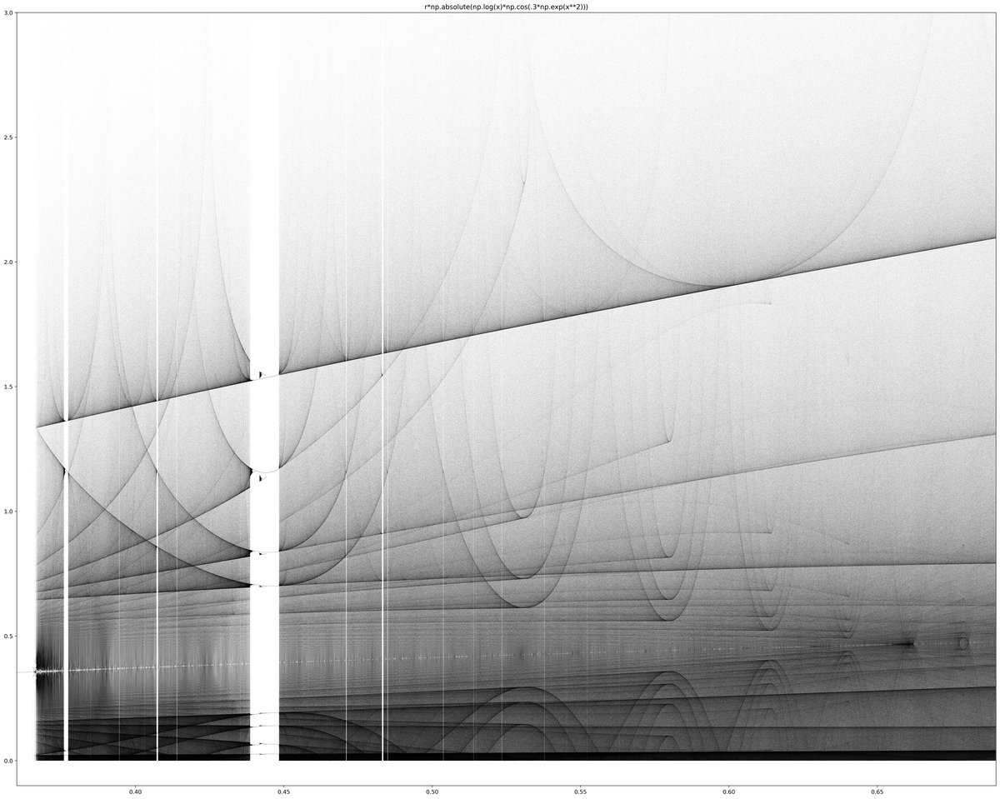

# Beautiful Chaos in the Bifurcation Diagram



*Function: `r * |ln(x) * cos(0.3 * e^(x²))|`*

## What is a Bifurcation Diagram?

A bifurcation diagram is a visual map of how a dynamical system's long-term behavior changes as you vary a parameter. Start with a simple equation, iterate it thousands of times, and plot where the values eventually settle.

At low parameter values, the system converges to a single point—stability. Increase the parameter, and the system begins oscillating between two values, then four, then eight. This *period-doubling cascade* accelerates until, at a critical threshold, periodicity shatters entirely.

What remains is chaos.

## The Logistic Map and Beyond

The classic example is the logistic map: `x(n+1) = r * x(n) * (1 - x(n))`. Its bifurcation diagram is famous—a tree that fractures into infinite branches, with windows of sudden order appearing within the chaos, only to splinter again.

But the logistic map is just one function. This project explores others.

By combining exponentials, logarithms, and trigonometric functions in various arrangements—`e^x`, `cos(x)`, `ln(x)`—I discovered that many produce their own chaotic regions with entirely different visual signatures. Each function carves its own path through the parameter space, generating unique patterns as iterations accumulate and values scatter toward infinity.

## The Images

These images capture the chaotic regions of various bifurcation diagrams. Each point represents one of the final iterations of the equation at a given parameter value. Where the system is stable, points cluster into clean lines. Where chaos reigns, they disperse into intricate structures—fractals emerging from pure mathematics.

The darkness at the edges is not emptiness. It is where the function escapes to infinity, leaving behind these patterns as artifacts of its departure.

## Functions Explored

| File | Function |
|------|----------|
| `r*np.cos(x)` | `r * cos(x)` |
| `r*np.sin(x)` | `r * sin(x)` |
| `r*np.absolute(np.log(x)*np.cos(.3*np.exp(x**2)))` | `r * \|ln(x) * cos(0.3 * e^(x²))\|` |
| `r*np.exp(-.5*(1-x)**2)*np.sin(.3*np.exp(x**2))` | `r * e^(-0.5(1-x)²) * sin(0.3 * e^(x²))` |
| `r*np.exp(-.5*(1-x)**2)*np.cos(.37*np.exp(x)**2)` | `r * e^(-0.5(1-x)²) * cos(0.37 * (e^x)²)` |
| `r*np.exp(-(1-x)**2)*np.sin(np.exp((x)**2))` | `r * e^(-(1-x)²) * sin(e^(x²))` |
| `r*np.exp(-(.5*x)**2)*np.sin(.2*np.exp(x**2))` | `r * e^(-(0.5x)²) * sin(0.2 * e^(x²))` |
| `r*np.exp(-0.7*(1-x)**2)*np.sin(np.exp((x)**2))` | `r * e^(-0.7(1-x)²) * sin(e^(x²))` |

## Running the Code

Each `.ipynb` file contains the complete code to generate its corresponding bifurcation diagram. The approach:

1. Define the iterative function
2. Create an array of parameter values (`r`)
3. Iterate the function thousands of times at each parameter value
4. Plot only the final iterations to reveal the asymptotic behavior

```python
import numpy as np
import matplotlib.pyplot as plt

def chaos(r, x):
    return r * np.absolute(np.log(x) * np.cos(0.3 * np.exp(x**2)))

n = 250000          # number of r values
iterations = 10000  # total iterations
last = 1000         # plot only the last N iterations

r = np.linspace(0, 0.69, n)
x = 1e-5 * np.ones(n)

for i in range(iterations):
    x = chaos(r, x)
    if i >= (iterations - last):
        plt.plot(r, x, ',k', alpha=0.25)
```

## Requirements

- Python 3
- NumPy
- Matplotlib
- Jupyter Notebook (for `.ipynb` files)

## Further Reading

- [Bifurcation diagram - Wikipedia](https://en.wikipedia.org/wiki/Bifurcation_diagram)
- [Chaos Theory and the Logistic Map – Geoff Boeing](https://geoffboeing.com/2015/03/chaos-theory-logistic-map/)
- [Logistic map - Wikipedia](https://en.wikipedia.org/wiki/Logistic_map)
